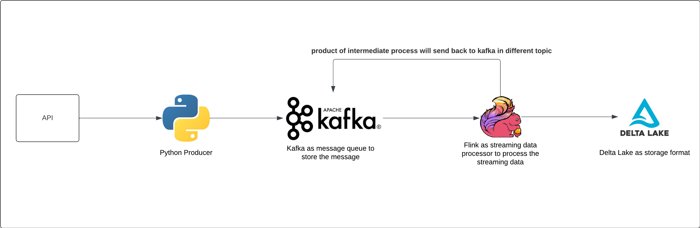

# Data Streaming Pipeline

This project demonstrates a data streaming pipeline using a Python container as a producer to fetch data from an
external API, publish it to Apache Kafka, and then use Apache Flink to consume messages from Kafka and store them into a
Delta table.

## Project Overview

The pipeline consists of the following steps:

1. Python Producer: A Python container fetches data from an API and sends the messages to a Kafka topic.
2. Kafka Broker: Acts as a messaging queue, where the producer sends the API data.
3. Flink Consumer - Parse response: Apache Flink reads the messages from the Kafka topic, parse the API response and
   write back to Kafka
4. Flink Consumer - Flink to reads the parsed message from kafka and write to delta tableWrite to Delta writes the
   output to a Delta Lake table for further analysis and persistence.

# Architecture

## Key Technologies

* Python: Used to fetch data from the API.
* Docker: All components ,except for storage layers, runs inside a Docker container, this enable
* Apache Kafka: Acts as a distributed streaming platform for storing and forwarding messages.
* Apache Flink: Processes the data from Kafka and writes it to Delta Lake.
* Delta Lake: A storage layer that brings reliability to data lakes for both batch and streaming data.

# Getting Started

## Prerequisites

To run this project, ensure you have the following software installed on your system:

* Docker
* Docker Compose

